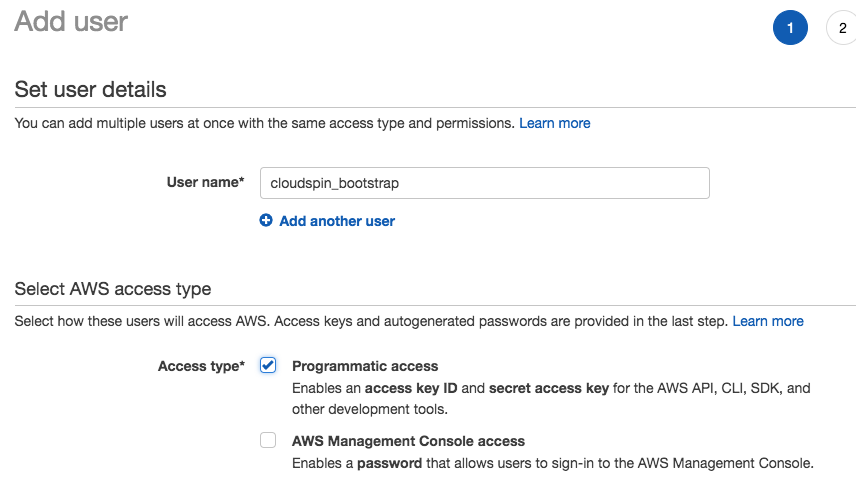
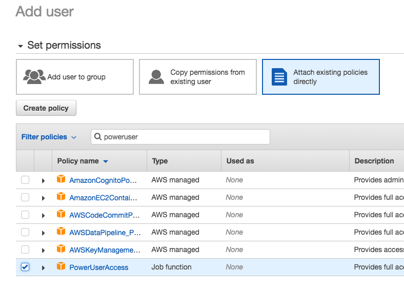

:source-highlighter: pygments

= Create a user for bootstrapping your AWS account

The example code and guides need an AWS account, and work by https://docs.aws.amazon.com/IAM/latest/UserGuide/id_roles_use.html[assuming an IAM role].

So you need an AWS account, and you need to set up IAM roles to assume, and an IAM user to assume them. The example code can help you do this.

[CAUTION]
====
It is *strongly* recommended that you use an AWS account dedicated for your learning, *not* an account that contains any infrastructure that you or anyone else cares about. It is quite simple to create a new AWS account, and generally free or very cheap if you don't use much resources.

We recommend this because it is good hygiene when working with tutorials, example code, etc., to avoid accidental damage or even key leakage.

We try to be fairly responsible with the CloudSpin code. For example, you should *never* need to put your AWS credentials anywhere other than the standard ~/.aws folder, which should prevent them from being accidentally committed to a source repository.

But accidents happen, so using a clean account limits the potential harm.
====

There are several steps involved in setting everything up:

1. Create and configure your bootstrap credentials, to be able to run the code to set things up. This is described in this page.
2. Use a cloudspin stack to create an S3 bucket to manage Terraform state for the following steps. This is described in the link:00-starting/setup-statebucket.adoc[next page].
3. Use a cloudspin stack to set up IAM roles to assume, and configure your local environment to use these. This is described in link:00-starting/setup-iam-roles.adoc[the page after that].

== (1.1) Create AWS bootstrap user

Ultimately, you will use an AWS IAM User that only has the permission to assume IAM roles in order to carry out activities. This is a basic building block for secure access management for an AWS account. But in order to run the code that sets up these IAM roles, you need to use API credentials which have broader permissions.

So the first thing you need to do is set up a "bootstrap" account with API credentials.

Using the AWS web console, create a user (for example, _cloudspin_bootstrap_) which has the privileges to manage the IAM roles and policies. This will normally be a one-off user; once the stack has been applied to an AWS account, anyone working with the infrastructure, including making IAM changes, should be able to do it using an unprivileged IAM user, and then assume roles with the relevant privileges.

=== (1.1.1) Create the bootstrap user

Go to the "IAM" service, go to "Users", and click the "Add User" button.

=== (1.1.2) Add the bootstrap user to relevant groups

When prompted, first add the user to the Power Users managed group by clicking "Add user to group", searching for the group, and ticking the box for the group in the results list:

Then click "Attach existing policies directly" button, do a search for the IAMFullAccess policy, then click the policy and click the button to continue.

=== (1.1.3) Get API access keys for the boostrap user

(TODO: we can probably limit this much further, may not need much more than a subset of IAM permissions).

If you selected "programmatic access" as in the screenshot for the earlier step, you'll be given a chance to copy the access credentials. The bootstrap user should not need a console password.

== (1.2) Add the bootstrap access key to your credentials file

Put the access credentials for the bootstrap user into your [AWS credentials file](https://docs.aws.amazon.com/cli/latest/userguide/cli-config-files.html). Give it a profile name, such as `bootstrap_cloudspin`.

File: `~/.aws/credentials`:
[source,ini]
----
[cloudspin_bootstrap]
aws_access_key_id = AKIA........
aws_secret_access_key = xxxxxxxxxxx
----

== (1.3) Test your bootstrap credentials

When you run:

[source,bash]
----
aws iam list-users --profile cloudspin_bootstrap
----

The output should be something like:

[source,console]
----
{
  "Users": [
    {
      "Path": "/",
      "UserName": "cloudspin_bootstrap",
      "UserId": "AKIA........",
      "Arn": "arn:aws:iam::999999999999:user/cloudspin_bootstrap",
      "CreateDate": "2018-11-02T15:47:42Z"
    }
  ]
}
----

