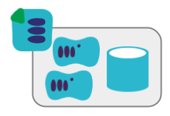

:source-highlighter: pygments

= What is a stack?

NOTE: Based on a blog post on http://infrastructure-as-code.com/patterns/2018/03/28/defining-stacks.html[infrastructure-as-code.com]

The term _Infrastructure Stack_ is something I've found useful to explain different patterns for organizing infrastructure code. An infrastructure stack is a collection of infrastructure elements defined and changed as a unit. Stacks are typically managed by tools such as https://www.terraform.io/[Hashicorp Terraform], https://aws.amazon.com/cloudformation/[AWS CloudFormation], https://docs.microsoft.com/en-us/azure/azure-resource-manager/resource-group-overview[Azure Resource Manager Templates], https://cloud.google.com/deployment-manager/[Google Cloud Deployment Manager Templates] and https://wiki.openstack.org/wiki/Heat[OpenStack Heat].

AWS CloudFormation uses the term https://docs.aws.amazon.com/AWSCloudFormation/latest/UserGuide/stacks.html["stack"], but it maps to other tools as well. When using Terraform, which I tend to use for code examples, a stack correlates to a Terraform project, and a statefile.

## Stack definitions

A stack definition is the code that declares what a stack should be. It is a Terraform project, CloudFormation template, and so on. A stack definition may use shared infrastructure code - for example, https://aws.amazon.com/blogs/devops/use-nested-stacks-to-create-reusable-templates-and-support-role-specialization/[CloudFormation nested stacks] or https://www.terraform.io/docs/modules/index.html[Terraform modules].

image:images/stack-definition.png[A stack definition is code used to provision stack instances]

## Stack instances

A stack definition can be used to provision, and update, one or more stack instances. There are two typical use cases for this.

image:images/stack-instances.png[Multiple stack instances can be provisioned from a single stack definition]

One use case is for multiple environments. If you have a stack called "my-service-stack", you can create an instance of your stack in DEV, another in QA, another in PROD, etc. Because you use the same stack definition for each of these, you know they are consistent in each environment. This is explained in more detail in link:stack-multiple-instances.adoc[creating multiple stack instances].

Another use case for re-using a stack definition for multiple roles. For example, if you have a general purpose stack that defines the infrastructure for a service, you might use it for "serviceA-stack" and "serviceB-stack". A given environment might have stack instances for each of these roles.

NOTE: https://twitter.com/techiewatt[Nicki Watt] has a great talk on https://www.youtube.com/watch?v=wgzgVm7Sqlk[Evolving Your Infrastructure with Terraform] which very clearly explains the benefits of using a stack definition for multiple instances, although she doesn't use exactly the same terminology that I do.

## A note on state

[NOTE]
====

One of the pain points of using Terraform is dealing with https://www.terraform.io/docs/state/[statefiles]. All stack management tools, including CloudFormation, etc., maintain data structures that reflect which infrastructure elements belong to a given stack instance. 

image:images/stack-state.png[Stack state]

CloudFormation and similar tools provided by cloud platform vendors have the advantage of being able to manage instance state transparently - they keep these data structures on their servers. Terraform and other third party tools need to do this themselves.

Arguably, the explicit state management of Terraform gives you more control and transparency. When your CloudFormation stack gets wedged, you can't examine the state data structures to see what's happening. And you (and third parties) have the option of writing tools that use the state data for various purposes. But it does require you to put a bit more work into keeping track of statefiles and making sure they're available when running the stack management tool.
====

